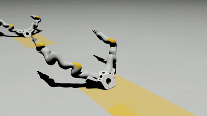
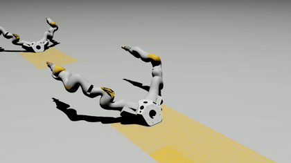
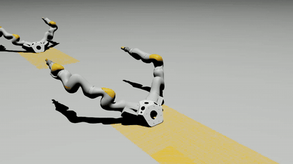
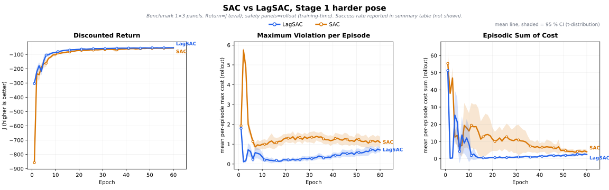

# Bimanual Peg-in-Hole: SAC vs Lagrangian SAC Safety Benchmark

This repository trains two KUKA iiwa arms in Isaac Sim to solve a bimanual
peg-in-hole task, then benchmarks an unconstrained baseline (**SAC**) against a
constrained variant (**Lagrangian SAC**). Both algorithms share the **same**
environment, **same** task reward, and **same** hard-absorbing safety guards;
the only algorithmic difference is LagSAC's cost critic and Lagrangian
multiplier λ. The benchmark reports 1×3 learning curves of **Discounted
Return** / **Maximum Violation per Episode** / **Episodic Sum of Cost**, with a
robust median + IQR aggregation across seeds.

> [!NOTE]
> This README describes the current verified project path: the Stage 1 SAC vs
> LagSAC safety benchmark, plus the 3-stage geometric curriculum that proves the
> peg-in-hole task is learnable end to end.

<table>
<tr>
<td align="center" width="33%">
<sub><b>Stage 1g — prepos</b><br>position alignment (h=100)</sub><br>
<a href="results/videos/full_chain_best_hold_2026-05-12/stage1g_prepos_best_hold_episode_000.mp4"></a>
</td>
<td align="center" width="33%">
<sub><b>Stage 2g — preaxis</b><br>add axis alignment (h=150)</sub><br>
<a href="results/videos/full_chain_best_hold_2026-05-12/stage2g_preaxis_best_hold_episode_000.mp4"></a>
</td>
<td align="center" width="33%">
<sub><b>Stage 3g — insert</b><br>clean insertion, pen ≈ 0 (h=200)</sub><br>
<a href="results/videos/full_chain_best_hold_2026-05-12/stage3g_insert_best_hold_episode_000.mp4"></a>
</td>
</tr>
</table>

The GIF previews above link to the full-resolution MP4s in
[`results/videos/full_chain_best_hold_2026-05-12/`](results/videos/full_chain_best_hold_2026-05-12/).

---

## Overview

Two parallel 7-DoF KUKA iiwa arms hold a peg and a hole. The right arm holds
the hole; the left arm holds the peg. The policy outputs 14-DoF joint-velocity
setpoints. Training proceeds through a 3-stage geometric curriculum:

| Stage | Objective | Horizon | Reward |
|---|---|---|---|
| **1g — prepos** | position alignment (tip toward hole) | 100 | linear depth + radial-tip penalty |
| **2g — preaxis** | + axis alignment | 150 | + axis + radial-max terms |
| **3g — insert** | clean peg insertion (penetration → 0) | 200 | 5-channel "v8" recipe (radial / axis / advance / penetration / dwell + bad-entry) |

The repo's main line is the **algorithm comparison at Stage 1** (where the
safety signal is most active); the Stage 3 insertion chain (verified
checkpoints in [`results/checkpoints/saved/`](results/checkpoints/saved/))
serves as the task-feasibility anchor.

---

## Method

### Safety design

The current benchmark separates task reward from safety cost. Clearance
violations are logged as a continuous positive cost for constrained learning,
while physically unsafe contacts are kept as absorbing terminations.

| Component | Reward? | Cost? | Terminates? | Role |
|---|:-:|:-:|:-:|---|
| task geometry reward | ✓ | ✗ | ✗ | drives task |
| arm-arm sphere-proxy clearance | ✗ | ✓ continuous | ✗ | soft clearance constraint |
| arm/EE-table clearance | ✗ | ✓ continuous | ✓ | + soft cost + hard guard |
| PhysX arm contact | cliff only | counted | ✓ | guard against suicide policy |

Per-step cost = `max(arm_arm_violation, table_violation)`, normalized to a
positive constraint (no clip). SAC sees the same env but ignores the cost;
LagSAC's λ is driven by the **rollout** episode cost (not eval), updated as
`Δlog λ = lr_λ · (cost − cost_limit)`.

### Benchmark metrics

Each benchmark pose is summarized with a 1×3 learning-curve figure:

1. **Discounted Return** (eval, deterministic policy)
2. **Maximum Violation per Episode** — mean over episodes of `max_t cost_t` (rollout)
3. **Episodic Sum of Cost** — mean over episodes of `Σ_t cost_t` (rollout)

Aggregation: **median + Q1–Q3 band** by default (robust to LagSAC's
occasional single-seed collapse). Mean ± std / sem available via `--band`.
Strict mode refuses to plot runs missing `rollout_ep_max_violation` /
`rollout_ep_cost` / `cost_scale=1.0` — use `--allow_legacy_proxy` to replay
older logs with a clearly-warned per-step proxy.

---

## Results

### Stage 1 benchmark — harder pose, 10 seeds, 60 epochs

`geom_d_sat=0.8` · `initial_joint_noise=0.05` · LagSAC `cost_limit_per_ep=10`.



Median learning curves with Q1–Q3 shaded bands, generated by
[`scripts/plot_paper_benchmark.py`](scripts/plot_paper_benchmark.py). One
LagSAC seed (s3) collapses; the IQR aggregation absorbs it without
distorting the central trend.

**Headline (epoch 60, median [Q1, Q3])**

| Metric | LagSAC | SAC | LagSAC vs SAC |
|---|---:|---:|---|
| Discounted Return (J) | −79.8 [−115, −56] | −91.7 [−117, −65] | tie / mild Lag |
| Maximum Violation per Episode¹ | 0.04 | 0.04 | tie (uninformative; legacy proxy) |
| Episodic Sum of Cost | **2.18** [0.97, 5.55] | 4.29 [2.68, 9.24] | **≈ 1.97× safer** |
| Cumulative sphere collisions (training)² | **601 ± 309** | 2160 ± 660 | **≈ 3.6× safer** |

¹ This benchmark predates the new `rollout_ep_max_violation` logging and falls
back to a per-step proxy; values are not the true paper metric. New runs will
plot the real metric in strict mode.

² Mean ± std reported here for cross-check with the earlier 2026-05-18 run.

The full Stage 1 / Stage 3 ablation discussion lives in
[`docs/PAPER_RESULTS.md`](docs/PAPER_RESULTS.md).

---

## Repository Layout

```
envs/                          IsaacSim env + safety cost wrapper
  dual_arm_peg_hole_env.py     parent env (also emits info["cost"] for monitor)
  dual_arm_peg_hole_cost_env.py  + Lagrangian wrapper

algorithm/lagrangian_sac.py    ConstrainedReplayMemory + SACLagrangian
networks.py                    actor / critic networks

scripts/
  train_sac.py                 SAC entry
  train_sac_lagrangian.py      Lagrangian SAC entry
  rollout_cost_tracker.py      shared per-episode cost SUM + MAX tracker
  _eval_utils.py               eval / hold / geom / cost metrics
  plot_paper_benchmark.py      1×3 benchmark figure + CSV (median+IQR default)
  analyze_overnight_paper.py   log → benchmark report
  visualize_policy.py          policy rollout viewer (X11)
  record_geom_video.py         standalone offscreen MP4 recorder (Replicator)
  run_lagrangian_chain_local_from_yaml.py  local YAML-driven runner
  train_hydra.py               Hydra+Apptainer+Slurm cluster entry
  ...

conf/experiment/               canonical YAMLs (loaded by name through Hydra)
  lag_stage1_prepos_clearance_b_route.yaml     ← current Stage 1 LagSAC benchmark
  sac_stage1_prepos_clearance_clean_sphere.yaml ← current Stage 1 SAC benchmark
  lag_stage{2,3}_*_b_route_*.yaml              ← current Stage 2/3 constrained variants
  record_checkpoint.yaml                        ← cluster recording config

results/
  checkpoints/saved/           canonical verified ckpt chain (Stage 1g/2g/3g)
  paper_archive/               frozen snapshots (2026-05-18 benchmark + Stage 3 100ep)
  videos/full_chain_best_hold_2026-05-12/  3 stage-end demo MP4s (the hero videos above)
  plots/                       generated paper figures (gitignored; CI not required)

docs/
  PAPER_RESULTS.md             full ablation tables + narrative
  figures/                     paper figures embedded in this README
  README_legacy_*.md           historical README snapshots
```

---

## Installation

Requires NVIDIA Isaac Sim (tested 4.x) and `mushroom-rl` ≥ 2.0-rc1 (editable
install on the `dev` branch). The env spec lives in
[`environment.yml`](environment.yml).

```bash
# (one-time) build a conda env named safe_rl
conda env create -f environment.yml
conda activate safe_rl

# mushroom-rl editable from the dev branch
git clone --branch dev https://github.com/MushroomRL/mushroom-rl.git ~/mushroom-rl
pip install -e ~/mushroom-rl

# Isaac Sim Python is expected at ~/isaac-sim/python.sh or wired via
# scripts/run_lagrangian_chain_local_from_yaml.py (local) /
# scripts/train_hydra.py (cluster)
```

---

## Quick Start

Activate the env and launch a Stage 1 run:

```bash
cd ~/bimanual_peghole
source ~/miniconda3/etc/profile.d/conda.sh
conda activate safe_rl

# LagSAC, benchmark defaults
python scripts/run_lagrangian_chain_local_from_yaml.py \
  --start_stage 1 --stop_stage 1 \
  --stage1_cfg conf/experiment/lag_stage1_prepos_clearance_b_route.yaml \
  --tag manual_lagsac_s1

# SAC baseline (same env, same reward)
python scripts/run_lagrangian_chain_local_from_yaml.py \
  --start_stage 1 --stop_stage 1 \
  --stage1_cfg conf/experiment/sac_stage1_prepos_clearance_clean_sphere.yaml \
  --tag manual_sac_s1
```

A full 10-seed paired benchmark template:
[`scripts/run_final_benchmark_2026-05-20.sh`](scripts/run_final_benchmark_2026-05-20.sh).
A Stage 3 calibration template:
[`scripts/run_stage3_100ep.sh`](scripts/run_stage3_100ep.sh).

### Reproducing the benchmark figure

```bash
# from log files written by the runs above
python scripts/plot_paper_benchmark.py \
    --logs <log_dir> \
    --out_dir results/plots/<run_tag> \
    --settings final          # or 'default' / 'harder'
# default band = iqr (median + Q1–Q3). Force strict mode by NOT passing
# --allow_legacy_proxy; new runs have all required fields.
```

Outputs `stage1_<setting>_paper.svg` + `stage1_paper_curves.csv`.

---

## Pre-trained Checkpoints

The canonical 3-stage chain (used as warm-starts and as the hero videos above):

| Stage | Path | First success |
|---|---|---|
| Stage 1g prepos | [`best_hold.msh`](results/checkpoints/saved/Stage1g_h100_full_ep_cold_2026-05-12_18-35-31/best_hold.msh) | — |
| Stage 2g preaxis | [`best_hold.msh`](results/checkpoints/saved/Stage2g_preaxis_h150_from_h100_stage1_2026-05-12_19-50-00/best_hold.msh) | from S1g |
| Stage 3g insert | [`best_hold.msh`](results/checkpoints/saved/Stage3g_insert_h200_from_h100_h150_stage2_2026-05-12_21-01-11/best_hold.msh) | from S2g, ep 74 (SAC v8) |

Always evaluate with `best_hold.msh`, not `final_agent.msh` (the best policy
can appear earlier than the final epoch — see `Guardrails` in
`docs/PAPER_RESULTS.md`).

Visualize a checkpoint:

```bash
python scripts/visualize_policy.py \
  --agent_path results/checkpoints/saved/Stage3g_insert_*_2026-05-12_21-01-11/best_hold.msh \
  --geom_stage insert \
  --num_envs 4 --n_episodes 4
```

Record a checkpoint to MP4 (standalone, headless-compatible):

```bash
python scripts/record_geom_video.py \
  --agent_path <path>/best_hold.msh \
  --geom_stage insert \
  --capture_backend replicator   # headless / cluster
```

---

## Cluster Execution (Hydra + Apptainer + Slurm)

Long benchmark runs can be dispatched through Hydra:

```bash
python scripts/train_hydra.py --multirun \
  experiment@train=lag_stage1_prepos_clearance_b_route \
  train.seed=0,1,2,3,4,5,6,7,8,9
```

`train_hydra.py` resolves `experiment@train=<name>` to
`conf/experiment/<name>.yaml`, mounts the project into an Apptainer container,
and submits one job per override combination through the Slurm launcher in
`conf/config.yaml` / `conf/apptainer/`. Cluster paths are configured for
`/home/ruiwan/projects/Safe_RL_Peg_in_hole` and the Isaac Sim container's
`/isaac-sim/python.sh`.

---

## Guardrails (do not change during an active run)

`envs/dual_arm_peg_hole_env.py` · `envs/dual_arm_peg_hole_cost_env.py` ·
`scripts/train_sac.py` · `scripts/train_sac_lagrangian.py` ·
`scripts/rollout_cost_tracker.py` · the YAML used by the active run.

General invariants:
- `n_steps_per_epoch = horizon × num_envs` (a Mushroom `VectorCore`
  truncation quirk — see [`scripts/train_sac_lagrangian.py`](scripts/train_sac_lagrangian.py) header).
- Stage 3 insertion requires `exclude_ee_from_physx_self_collision: true`.
- Judge Stage 3 only after ≥ 80 epochs (SAC v8 typically breaks through at ep ~74).

---

## Acknowledgments

- The Lagrangian SAC implementation builds on
  [MushroomRL](https://github.com/MushroomRL/mushroom-rl)'s `dev` branch.
- Environment built on NVIDIA Isaac Sim with the dual-arm KUKA iiwa USD asset
  at [`assets/usd/`](assets/usd).
- Older READMEs preserved for context:
  [`docs/README_legacy_20260512.md`](docs/README_legacy_20260512.md) ·
  [`docs/README_pre_rewrite_20260518.md`](docs/README_pre_rewrite_20260518.md).
